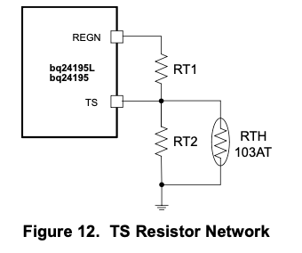
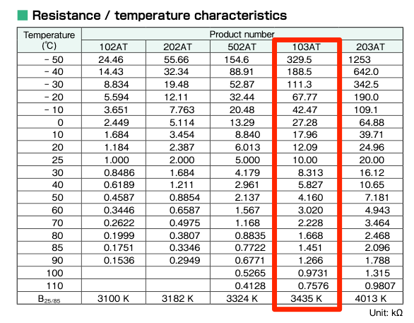
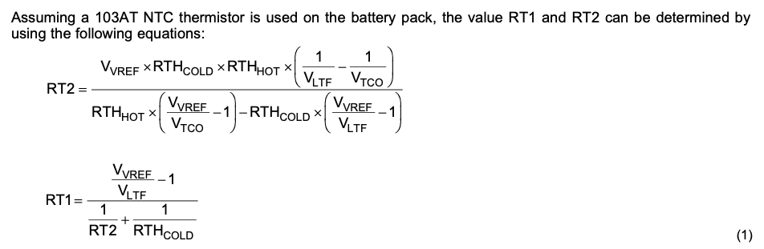
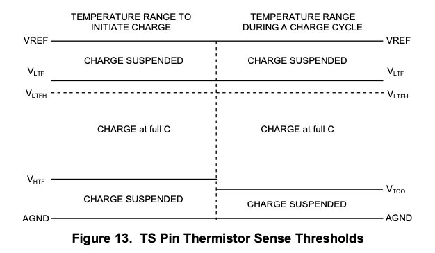
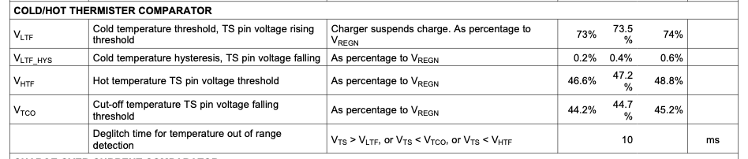

# bq24195 calculator

*Calculator for bq24195 temperature sensor*

## Resistor calculator

Assuming a battery with a 103AT 10K thermistor, this section will calculate $RT1$ and $RT2$

<table>
    <tbody>
        <tr>
            <td>High cut-off temperature</td>
            <td><input type="text" id="resCalcHigh" size="8" value="45" /></td>
            <td>&deg;C</td>
            <td>&nbsp;</td>
        </tr>
        <tr>
            <td>Low cut-off temperature</td>
            <td><input type="text" id="resCalcLow" size="8" value="0" /></td>
            <td>&deg;C</td>
            <td>&nbsp;</td>
        </tr>
        <tr>
            <td>High thermistor resistance</td>
            <td></td>
            <td>&ohm;</td>
            <td>For 103AT thermistor at temperature above</td>
        </tr>
        <tr>
            <td>Low thermistor resistance</td>
            <td></td>
            <td>&ohm;</td>
            <td>For 103AT thermistor at temperature above</td>
        </tr>
        <tr>
            <td>RT1</td>
            <td></td>
            <td>&ohm;</td>
            <td>Calculated high-side resistor</td>
        </tr>
        <tr>
            <td>RT2</td>
            <td></td>
            <td>&ohm;</td>
            <td>Calculated low-side resistor</td>
        </tr>
    </tbody>
</table>

## Cut-off calculator

## No temperature sensor

## Background

The bq24195 PMIC supports a temperature sensor, typically part of the battery pack, to control charging based on temperature. From the datasheet:

The temperature sensor is a NTC (negative temperature coefficient) thermistor. For example, the [103AT](https://www.digikey.com/en/products/detail/semitec-usa-corp/103AT-2/16579059), a 10K NTC thermistor.

When dealing with LiPo batteries, the charging is typically restricted to 0°C to 45°C. From the table and a little interpolation:

| Temperature | Resistance |
| :--- | :--- |
| 0&deg;C | 27.28 K&ohm; |
| 25&deg;C | 10 K&ohm; |
| 40&deg;C | 5.827 K&ohm; |
| 45&deg;C | 4.9935 K&ohm; (interpolated) |
| 50&deg;C | 4.160 K&ohm; |

There's this imposing formula in the datasheet for calculating $RT1$ and $RT2$:

And this figure:

This isn't as bad as it looks when you break it down. Some of these values are constants:

The thing that's somewhat confusing with all of these voltages like $V_{VREF}$ is that you never deal with the actual voltages in the calculations! Note that the top side of the voltage divider formed by $RT1$, $RT2$ and the battery thermistor is $REGN$. As it turns out, $REGN$ isn't constant, it varies depending on $VBUS$! However, everything is either relative to, or a proportion of $REGN$ so you don't need to know the actual value of it.

| Variable | Description |
| :---  | :--- |
| $RT1$ | High side of voltage divider |
| $RT2$ | Low side of voltage divider, in parallel with battery thermistor |
| $V_{VREF}$ | Reference voltage, a.k.a. $REGN$ |
| $V_{REGN}$ | Reference voltage, a.k.a. $V_{VREF}$ |
| $RTH_{HOT}$ | Resistance of thermistor at high temperature limit |
| $RTH_{COLD}$ | Resistance of thermistor at low temperature limit |
| $V_{LTF}$ | Cold temperature threshold, $0.735 \times V_{REGN}$ |
| $V_{HTF}$ | High temperature threshold, $0.472 \times V_{REGN}$ |
| $V_{TCO}$ | Cold temperature cut-off, $0.447 \times V_{REGN}$ |

